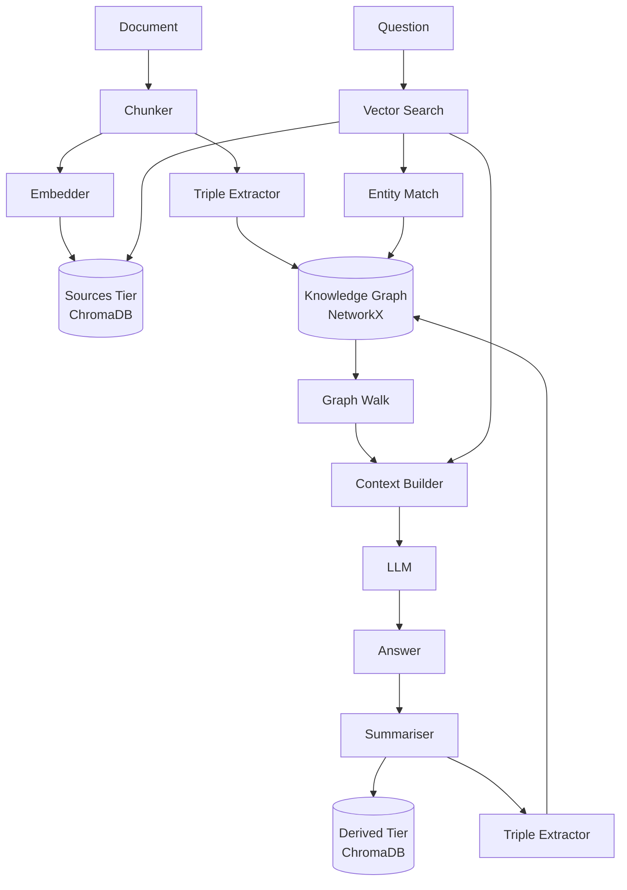

# graph-rag-memory

A small RAG system that builds its own knowledge graph as it reads, with tiered trust between source documents and its own answers.

---

## Why this exists

Vanilla RAG forgets: every query starts from scratch, and the system never builds up structured knowledge over time. Naively summarising answers back into the same vector store causes drift — the model starts retrieving its own paraphrases as if they were source truth. This project separates the two: source documents live in one collection, LLM-generated summaries in another (with a retrieval penalty), and a NetworkX knowledge graph holds extracted triples with explicit provenance so multi-hop questions have structured paths to follow.

---

## Architecture



---

## Quickstart

```bash
git clone <repo-url>
cd graph-rag-memory
pip install -e .

python examples/demo.py
```

The first run downloads the embedding model (~90 MB) and the LLM (~3 GB). Subsequent runs load from cache.

---

## How it works

**Tiered memory.** ChromaDB holds two collections: `sources` (ingested documents, full trust) and `derived` (LLM summaries, scored at `derived_weight × raw_similarity` during retrieval so they never outrank real sources at equal similarity). IDs are content-addressed, so re-ingesting the same file is a no-op.

**Real triples.** Rather than linking sentences with a generic "follows" edge, the system prompts the LLM to extract `(subject, relation, object)` triples and stores them as edges in a `MultiDiGraph`. The same entity pair can carry multiple labelled relations. Provenance (source file, chunk index, tier, confidence, timestamp) is stored on every edge.

**Hybrid retrieval.** On each query, vector search returns seed chunks; entity substring matching finds graph nodes mentioned in those chunks; a one-hop graph walk yields labelled fact strings. Both are passed to the LLM in clearly labelled prompt sections so it can reason over structured and unstructured evidence simultaneously.

**Self-feeding loop with guardrails.** After answering, the LLM summarises its answer and the summary goes into the derived tier. Triples extracted from the summary go into the graph tagged `tier="derived"`. The retrieval penalty prevents derived content from crowding out original sources, and the tier label is always visible in the returned provenance.

---

## Project structure

```
grag/
├── __init__.py     # exports RAG, Config
├── config.py       # Config dataclass (paths, model names, knobs)
├── llm.py          # HuggingFace pipeline wrapper with chat-template support
├── memory.py       # ChromaDB two-tier store
├── graph.py        # NetworkX MultiDiGraph with provenance
├── extractor.py    # LLM-based triple extraction, JSON + regex fallback
├── ingest.py       # File loaders (.txt/.md/.pdf), chunking, dispatch
└── rag.py          # RAG class — query() orchestrates everything
```

---

## Roadmap

- **Contradiction detection**: before inserting a derived triple, check for conflicting edges and flag them rather than silently adding.
- **Entity merging**: normalise aliases (`"A. Einstein"` → `"albert einstein"`) using fuzzy matching or a dedicated NER model.
- **`user_confirmed` tier**: a third trust level for facts the user explicitly marks as correct, ranking above sources during retrieval.
- **API LLM option**: drop-in support for Claude or OpenAI so users without a GPU can run the system.
- **Evaluation harness**: benchmark on a multi-hop QA dataset (e.g. HotpotQA) to measure whether the graph walk actually improves accuracy.

---

## License

MIT — see [LICENSE](LICENSE).
