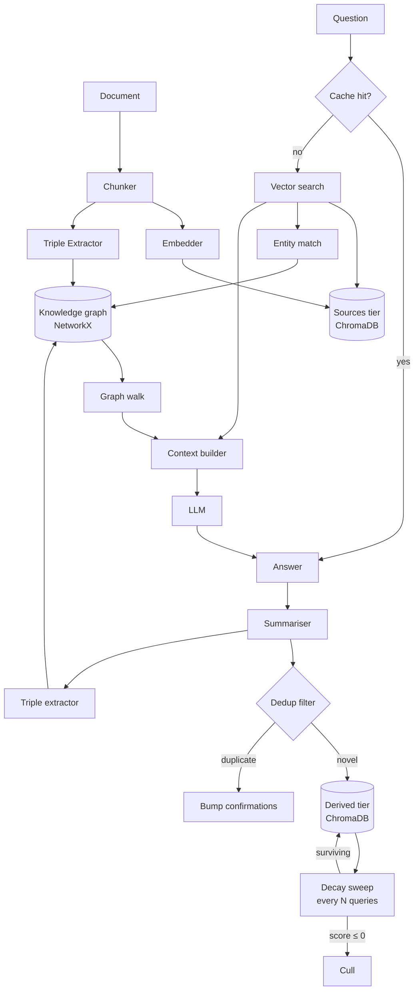

# graph-rag-memory

A RAG system that builds its own knowledge graph as it reads — and forgets what it no longer needs.

Most RAG systems treat memory as append-only. This one treats it like a brain: facts that get used regularly stay sharp, facts that don't get used fade, and the system compacts itself to stay coherent over time.

---

## Why this exists

Three problems with standard RAG:

**It never forgets.** Every chunk ever ingested stays in the vector store with equal weight. Over time, stale, redundant, and hallucinated summaries accumulate and degrade retrieval quality.

**It drifts when it talks to itself.** Naive self-improving RAG — storing LLM answers back into the same collection as source documents — causes the model to retrieve its own paraphrases as if they were source truth. Give it enough iterations and it's mostly talking to itself.

**It has no sense of what it actually used.** Standard vector retrieval ranks by similarity at query time, but has no memory of which chunks were useful across many queries. A chunk retrieved 50 times should be treated differently from one retrieved once.

This project addresses all three.

---

## How memory works

### Tiered storage

Two ChromaDB collections with different trust levels:

- **`sources`** — ingested documents. Full retrieval weight. Never overwritten by the system.
- **`derived`** — LLM-generated summaries of its own answers. Penalised during retrieval so they never outrank real sources at equal similarity.

A derived chunk that contradicts a source chunk will always lose in retrieval. Provenance is shown on every answer so you can see which tier each piece of context came from.

### Decay-based scoring

Every chunk and every graph edge carries a live score. The score changes over time according to two forces:

**Decay** — a periodic sweep (every N queries, configurable) subtracts a fixed amount from every entry's score. Entries that aren't accessed regularly drift toward zero and eventually get culled.

**Access bumps** — when a chunk or edge is actually used in answering a query, its score is incremented. Frequently-used knowledge stays healthy regardless of age.

The result: the system naturally retains knowledge that proves useful and discards knowledge that doesn't. No manual curation needed.

```
score over time (one entry):

  10 │     ╭─╮   ╭─╮   ╭──╮
     │  ╭──╯ ╰───╯ ╰───╯  ╰──
   5 │──╯                     ╲
     │                         ╲ culled
   0 │─────────────────────────────────
     ├─── sweep ─── sweep ─── sweep ───▶ queries
```

Each spike is an access bump. Each drop is a sweep. An entry that stops being used slides to zero.

### Memory pressure scaling

When the derived tier grows large, the decay rate scales up automatically. At the soft limit (`soft_limit` in `grag_params.yaml`) the rate is normal. At twice the soft limit it doubles. This creates a self-regulating pressure valve — the more bloated the memory gets, the faster it cleans itself up, without any hard caps or manual intervention.

### Write-time deduplication

Before a new derived chunk is stored, it passes two filters:

**Cosine check** — if the new chunk is very similar to an existing one (above `cosine_max`), it's rejected. The nearest existing entry gets its confirmation count incremented instead.

**Residual novelty check** — the new chunk's embedding is projected onto the subspace spanned by its nearest neighbours. If the residual norm is small (below `residual_min`), the chunk is explained by existing knowledge and rejected. This catches the case where a new summary is "a mixture of existing entries" rather than a single near-duplicate.

### Confirmation floor protection

Entries that have been confirmed many times (via repeated retrieval and dedup hits) become exempt from decay. They've earned their place. This prevents the system from forgetting things that have been repeatedly proven useful.

---

## Architecture



---

## Quickstart

```bash
git clone <repo-url>
cd graph-rag-memory
pip install -e .

python examples/demo.py
```

The first run downloads the embedding model (~90 MB) and the LLM (~3 GB). Subsequent runs load from cache.

### Demo commands

| Command | What it does |
|---|---|
| `:stats` | Score distributions, sweep counters, cache size, memory pressure |
| `:compact` | Force an immediate aggressive decay sweep |
| `:graph` | Node and edge counts by tier |
| `:reset` | Wipe all memory and rebuild from scratch |
| `:quit` | Exit |

---

## Tuning

All parameters live in `grag_params.yaml` at the repo root. Edit and restart to apply.

```yaml
decay:
  decay_every_n_queries: 10    # how often the sweep runs
  decay_per_sweep: 0.5         # score subtracted per sweep
  access_increment: 1.0        # score added when an entry is used
  initial_score_source: 100.0  # sources start with a large buffer
  initial_score_derived: 5.0   # derived entries must earn their place
  confirmation_floor: 5        # entries confirmed this many times are decay-exempt

memory_pressure:
  soft_limit: 10000            # derived chunks above this accelerate decay

dedup:
  cosine_max: 0.85             # reject if too similar to existing entry
  residual_min: 0.20           # reject if explained by existing entries

spread:
  enabled: false               # activation spreading — see Roadmap
```

---

## Project structure

```
grag/
├── config.py       # Config dataclass, loads from grag_params.yaml
├── llm.py          # HuggingFace pipeline wrapper
├── memory.py       # ChromaDB two-tier store with decay sweep
├── graph.py        # NetworkX MultiDiGraph with provenance and decay
├── extractor.py    # LLM triple extraction, JSON + regex fallback
├── ingest.py       # File loaders (.txt / .md / .pdf), chunking
├── dedup.py        # Residual novelty filter
├── access.py       # Access scoring with spreading activation hooks
└── rag.py          # RAG class — query() orchestrates everything

examples/
├── demo.py                  # interactive CLI
├── compaction_test.py       # behavioural test with plots and CSV output
└── sample_docs/einstein.txt # demo document
```

---

## Roadmap

- **Activation spreading** — when a chunk is accessed, propagate a fraction of the access bump to semantically nearby chunks. Infrastructure is already in place (`access.py`), gated by `spread.enabled` in the params file.
- **Contradiction detection** — before inserting a derived triple, check for conflicting edges and surface them rather than silently appending.
- **Entity merging** — normalise aliases (`"A. Einstein"` → `"albert einstein"`) using fuzzy matching.
- **`user_confirmed` tier** — a third trust level for facts the user explicitly marks correct, ranking above sources during retrieval.
- **API LLM option** — drop-in support for an external model so users without a GPU can run the system.
- **Evaluation harness** — benchmark on a multi-hop QA dataset (HotpotQA or similar) to measure whether the graph walk and memory decay actually improve accuracy.

---

## License

MIT — see [LICENSE](LICENSE).
