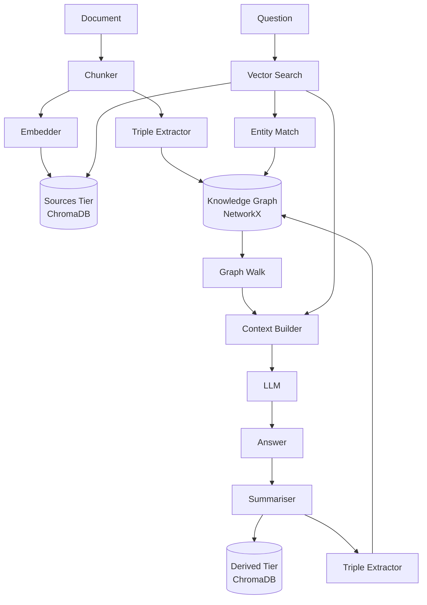

# Architecture

## Diagram

---

## Component notes

### Chunker (`ingest.py`)

Character-based splitting with a configurable overlap (`chunk_size=1500`, `chunk_overlap=150` by default). Overlap ensures that triples that span a chunk boundary can still be extracted. Each chunk gets a content-addressed ID (`file_hash + "_" + chunk_index`), making re-ingestion idempotent without needing a separate tracking file.

### Embedder + Sources tier (`memory.py`)

`sentence-transformers/all-MiniLM-L6-v2` produces 384-dimensional dense vectors. ChromaDB handles HNSW indexing. The `sources` collection is the ground-truth store: nothing that the LLM generates can be written here.

### Triple Extractor (`extractor.py`, `llm.py`)

A prompt asks the LLM to emit a JSON array of `{"subject", "relation", "object"}` objects. `do_sample=False` forces greedy decoding to reduce hallucination in structured output. A regex fallback handles responses where the JSON is syntactically broken but the key-value pairs are still present. Output is capped at 10 triples per chunk to prevent noise accumulation.

### Knowledge Graph (`graph.py`)

`nx.MultiDiGraph` was chosen over `DiGraph` because the same entity pair can legitimately carry multiple distinct relations (e.g., Einstein `born_in` Ulm AND `died_in` Princeton). Using a plain `DiGraph` would silently discard all but the last relation written for a pair. Every edge stores `relation`, `source_id`, `tier`, `confidence`, and `created_at` as attributes, so any edge can be traced back to the document or query that produced it. The graph is persisted to GEXF after every write — GEXF is human-readable XML, which makes manual inspection easy during development.

### Derived tier and retrieval weighting (`memory.py`)

Scores returned by ChromaDB are cosine distances. Converting to similarity (`1 - distance`) gives a value in [0, 1]. Derived-tier scores are multiplied by `derived_weight` (default 0.6) before sorting. At equal raw similarity, a source chunk will always rank higher than a derived summary. This prevents the system from gradually replacing ground-truth passages with its own paraphrases as the derived collection grows.

### Context Builder + LLM (`rag.py`)

The prompt presents two clearly labelled sections — "Retrieved passages" (tagged `[SOURCE]` or `[DERIVED]`) and "Related facts from knowledge graph" — so the LLM can reason over both evidence types and the user can see, in the returned provenance dict, exactly which chunks and facts contributed to the answer.

### Self-feeding loop

After answering, the answer is summarised and the summary is stored in the derived tier. Triples extracted from the summary enter the graph tagged `tier="derived"` with `confidence=0.7`. Over many queries, the graph accumulates derived edges that can act as shortcuts for future multi-hop questions, but the retrieval penalty and tier tags ensure the system never loses sight of what it actually read versus what it inferred.
